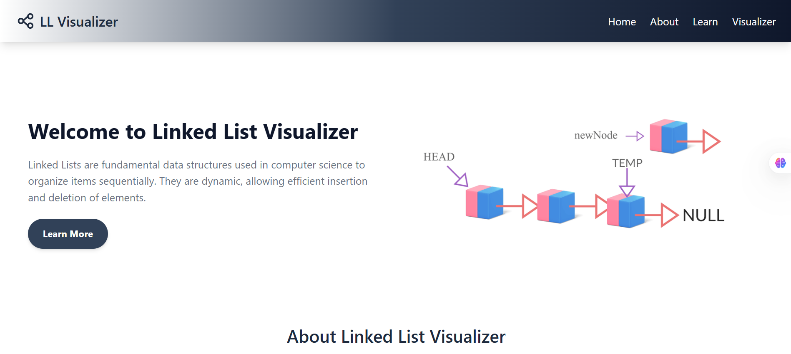
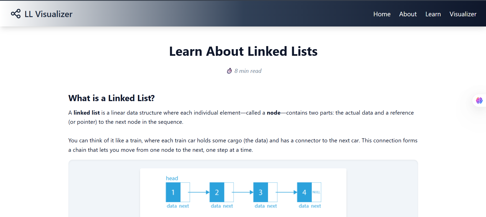
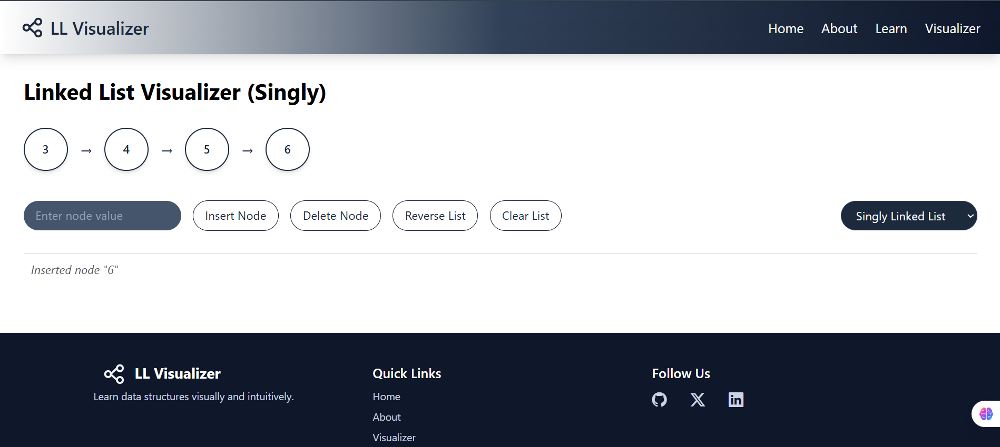

# 🔗 Linked List Visualizer

An interactive and intuitive **Linked List Visualizer** built with **React** and **Tailwind CSS**, designed to help learners understand how linked lists work — including **Singly**, **Doubly**, and **Circular** linked lists.


👉 **[Click here to view the live website](https://linkedlist-visualizer.vercel.app/)** 





---

## 🌟 Features

-  Visualize **Singly**, **Doubly**, and **Circular** Linked Lists
- Insert Node
-  Delete Node
-  Reverse List
-  Clear List
-  Responsive and modern UI with Tailwind styling
- Interactive mini quiz

---

## 🛠️ Tech Stack

- **Frontend**: React.js
- **Styling**: Tailwind CSS
- **Icons/Arrows**: Inline SVG & Unicode characters

---


## 🚀 Getting Started

### 1. Clone the Repo

```bash
git clone https://github.com/yourusername/linked-list-visualizer.git
cd linked-list-visualizer
```

### 2. Install Dependencies
``` bash
npm install
```
### 3. Start the Development Server
``` bash
npm run dev
```
This project uses Vite for faster development.

##  Use Case
This project is ideal for:

 - Students learning Data Structures & Algorithms
 - Educators or tutors who want to demonstrate linked lists visually
 - Developers building DSA-focused tools or platforms

## License

This project is licensed under the MIT License. See the [LICENSE](LICENSE) file for details.

## Contact

For any inquiries or feedback, please contact:

- **Name**: Simran  
- **GitHub**: [SIMRAN-202](https://github.com/SIMRAN-202)  
- **Email**: kaursimrankaur2003@gmail.com